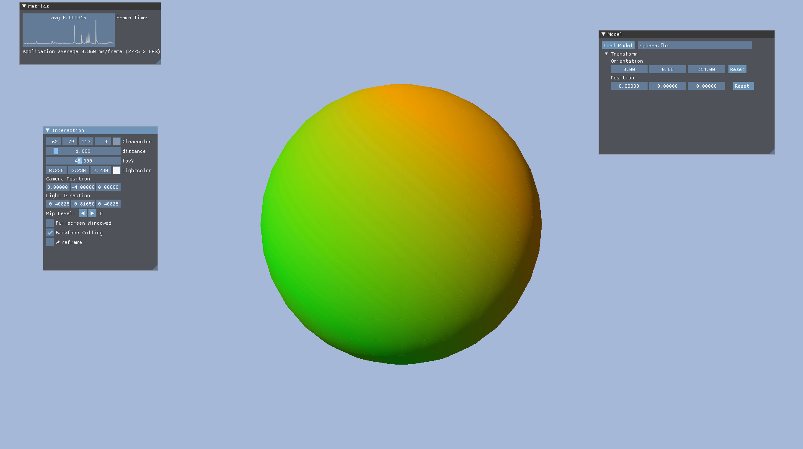

# Not Yet Another eNgine

## Description

This is supposed to be a simple lightweight high-performance render-engine based on vulkan.

## Features

Currently, a basic fbx-model-viewer with simple Blin-Phong shading has been implemented in the fbx demo. Furthermore, the foundations for complex render tasks have been sett with the abstractions
and rendergraph.

## Progress

- [x] Linear Algebra
	- [x] Vectors
	- [x] Matrizes
	- [x] Quaternions
- [x] Utility
	- [x] Hash
	- [x] HashMap
	- [x] LinkedBucketList
	- [x] Pool
	- [ ] ...
- [ ] Renderer
	- [x] Rendergraph (partial)
	- [ ] UI
	- [ ] Lights
	- [ ] Deferred renderer
	- [ ] Forward renderer
	- [ ] Mesh representations
		- [ ] Skeletal mesh
		- [ ] Morph targets/Blend shapes
		- [x] Static mesh
		- [ ] Heightmap
	- [x] Tangent basis
- [x] Vulkan
	- [x] Pipeline abstraction
	- [x] Renderpass abstraction
	- [x] Descriptor abstraction
	- [x] Swapchain abstraction
	- [x] Framebuffer abstraction
	- [x] Sampler abstraction
	- [x] Descriptor set management 
	- [x] Command Pool abstraction
	- [x] Command Buffer abstraction
	- [x] Buffer abstraction
	- [x] Image abstraction
	- [x] Sparse Images
	- [x] Compute shaders
	- [ ] ...
- [ ] Scene representation
- [ ] I/O

## Requirements

The engine depends on the following libraries:

- [Vulkan SDK](https://vulkan.lunarg.com/): must be manually installed
- [FBX SDK](https://www.autodesk.com/developer-network/platform-technologies/fbx-sdk-2020-2): must be manually installed (for now, in future optional) (Expects FBXSDK_DIR to be set in UserSettings.txt)
- [GLFW](https://github.com/glfw/glfw): automatically fetched
- [GTest](https://github.com/google/googletest): automatically fetched
- [Imgui](https://github.com/ocornut/imgui): automatically fetched
- [SPIRV-Cross](https://github.com/KhronosGroup/SPIRV-Cross): automatically fetched
- [volk](https://github.com/zeux/volk): automatically fetched
- [Vulkan Memory Allocator](https://github.com/GPUOpen-LibrariesAndSDKs/VulkanMemoryAllocator): included in this repository